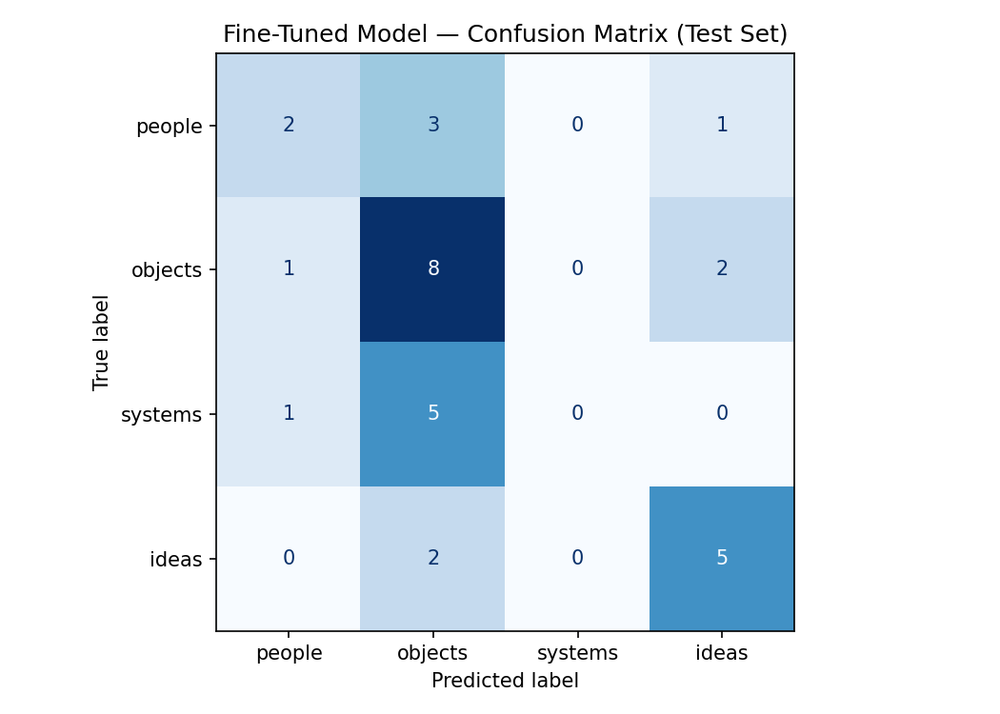

<!-- Annotated dataset(at least examples): Where you collected the data, 
your labeling process, 
your labe process, 
your label distribution (count per label ),
at least 3 examples you found genuinely difficult to label  and what you decided 

Fine-tunning pipeline: 
describe the model you started from, the training approach , and at least one key hyperparameter decision you made (e.g., learning rate, number of epochs, batch size).

Commit the interface code to your repo and document how to run it in your README.md

Before you commit to your labels, find one post like this in your community. Write down which labels it could belong to, and write the decision rule you'll use. This is the most valuable design work you'll do before annotating 200 examples.

-->

# TakeMeter
--- 
## Community 

**What community was chosen?**

The reddit community of r/unpopularopinion on the contrary is a popular community! With two point two million weekly visitors and seventy seven thousands weekly contributors the community has diverse opinions on subjects. 

**Why is this community a good fit for a classification task — what makes the discourse varied enough to be interesting?**
The community of unpopular opinion is a great fit for classification task due to its many categories and polarized opinions in those categories. 

---

## Labels

**What are your 2–4 labels? Define each in a complete sentence. Include 2 example posts per label.** 
### People 
 This label represents opinions about humans or human behavior. \
Example post: 
1. "We need to stop idolizing celebrities and start appreciating regular people. "
2. "I’ll be honest, I don’t respect janitors "

Considered an uncertain case:
- " I'd say this is a mainstream opinion these days. Unless you are dropping something at the door and don't intend to come in. But otherwise, a text is now common courtesy. "
- Decision:  labeled people - this is an opinion about behavior in which a person by do by arriving at a another person's house unannounced.

### Objects 
 This label evaluates a concrete, consumable, or experienceable thing. 
1. "Vanilla doesn't belong in the bathroom."
2. "The steam machine isn't necessarily "too expensive". "

Considered an uncertain case: 
- "If locally-owned grocery stores want your money, they need to provide comparable prices to the corporations"
-  Decision: labeled systems — this is an opinion about market structure and corporate competition, not the grocery store as a physical/consumable thing.

### Systems 
This labels defines posted opinions about organized structures in society that often include institutions, rules, systems, social structures. 
Example post:
1. "No child left behind started like 20+ years ago it’s not new unless I’m missing something. But also it’s been wildly unpopular ever since its inception. "
2. "The popular advice to "never admit fault" in a car accident is sociopathic and ridiculous, of course you should admit fault if you are at fault " 

Considered an uncertain case:
- "I don't think we should waste the extra tax money or teachers time on 3 more years of school for someone who isn't interested in learning" 
-  Decision: labeled systems - the post is an opinion that points out a government rule and something pertaining to an institution - "tax money", "teachers".

### Ideas 
The opinion directly evaluates an abstract belief, value, or claim about truth. 
1. "Unconditional love is the biggest lie "
2. "Exercise should be prescribed with the same seriousness as medication. " 

Considered an uncertain case:
- "Modern suburbia is one of the most socially isolating environments humans have built at scale."
-  Decision: labeled ideas — this is an opinion about socially induced environments for humans.


**Inter-annotator reliability:**

<!-- Have at least one other person label 30+ of your examples independently, and report your agreement rate (Cohen's kappa or simple percentage agreement). Analyze where you disagreed. -->
Utilizing an outside source to label examples independently, the agreement rate on averages was only 30%. The most disagreeable labels were "objects" with "people" coming in second. The label "objects" seems to be the most polarized due its broad covering topics and subject. 30 examples were independently labeled.

**Examples used with disagreements:**

"People have the wrong idea about math and the benefit of learning math. " - people, ideas. Annotator 1 used people as a label for the behavior of people, while annotator 2 labeled the post as an idea or philosophy.

"I don't like holidays" - systems, ideas. Annotator 1 used systems as a label for holidays is social structure, while annotator 2 labeled the post as an idea for a feeling a particular day.

"All businesses should prioritize stalls over urinals " - objects, ideas. Annotator 1 used objects as a label for the object of restroom items, while annotator 2 labeled the post as an idea for the word prioritize.


**Examples used:**

"Tuna fish isn't stinky and should be allowed to be eaten everywhere " 

"Hot bus changes everything. I have smelled Popeye’s on the bus and felt deep hatred I’m so sorry Popeye it was the bus" 

"It's July, have you started your Christmas shopping yet?"

"People have the wrong idea about math and the benefit of learning math. " 

"Humans are naturally bi "
        
"Growing older is not the curse people make it out to be. It's actually a blessing. "
        
"People who hog overhead bins with personal items and small bags are ruining flights for everyone."

"If locally-owned grocery stores want your money, they need to provide comparable prices to the corporations. "

"Women get shamed for spending money on skincear but nobody says anything when men drop thousands on sneakers, gaming setups, or golf clubs "
        
"Chicago has a better cityscape than New York City "

"In sports, there's no point in absolutely thrashing a demonstrably weaker team. Just do enough to win."
        
"The massive fear of being "cringe" is one of the biggest enemies of creativity. "
        
"Unconditional love is the biggest lie "
        
"The era of acceptance has created an opposite effect "
        
"I don't like holidays"
        
"Iceberg is the worst lettuce"
        
"You don’t understand architecture is not a valid defense of ugly buildings"
        
"Quitting your job to chase a dream should be encouraged"
        
"Vehicle Classes Are Ultra Important When OffRoading and Modifying Vehicles"
        
"Making friends in your 30s is not as hard as everyone claims it to be"
        
"Possums are Cute!!! "
        

        
"Being 10 minutes early is just as inconsiderate as being 10 minutes late. "

"The only reason we are unhappy is that we constantly compare ourselves to others "
        
"Iron Lung and The Backrooms only did as well as they did because YouTubers made them."
        
"Toxic Fandoms are inevitable sign of excellence and should be encouraged "
        
"McDonald's coffee is better than Starbucks"
        
"Everyone should be an archivist "
        
"When I ask a question on a help forum, I don’t want to be texted a youtube video and told “Just watch this” ."
        
"People who fantasize about living through an apocalypse or growing up in primitive times have no idea how ass living in times like that would actually be. "

"Golf and tennis should not be 'silent' sports."

---
**Confidence calibration:** 
<!--Report whether your model's confidence scores are meaningful — does a 90% confident prediction actually get it right more often than a 60% confident one? -->

 The model's confidence scores showed limited correlation with accuracy. Predictions in the 90–100% confidence range were correct 71% of the time, while predictions in the 60–70% range were correct 50% of the time. This suggests the model is overconfident — it assigns high softmax probabilities even on categories it misclassifies (particularly Systems, which scored 0.00 F1 but still received high-confidence wrong predictions). A well-calibrated model would show accuracy ≈ confidence at each bucket; the gap here reflects that DistilBERT's softmax outputs are not reliable probability estimates without additional calibration (e.g., temperature scaling).


---

**Error pattern analysis:** 
<!--Go beyond listing individual wrong predictions — identify a systematic pattern in the errors (e.g., "the model consistently misclassifies sarcastic posts" or "it can't distinguish X from Y when the post is short"). -->
Systems scored 0.00 F1 — every single Systems post was misclassified. The pattern across all 3 wrong predictions is the same: the model classifies based on the dominant noun (school, shower, property) rather than the nature of the judgment. When a post critiques a rule or institution using a physical anchor word, the model assigns Objects or People instead of Systems.  

---

**Deployed interface:**

A Gradio web interface (`app.py`) accepts a post, runs it through the fine-tuned DistilBERT classifier, and displays the predicted label, confidence percentage, and a bar chart of scores across all four labels.

**Setup — save the model from Colab first:**
```python
# Run this at the end of your Colab training notebook
model.save_pretrained("model")
tokenizer.save_pretrained("model")
```
Download the `model/` folder from Colab (or Google Drive) into the project root so the path `./model/` exists locally.

**Install dependencies:**
```bash
pip install -r requirements.txt
```

**Run the interface:**
```bash
python app.py
```
Open `http://localhost:7860` in a browser. Enter any post and the classifier returns the label and confidence immediately.

---


## Hard edge cases

**What type of post will be genuinely ambiguous between two labels?**
 
 A post will be considered genuinely ambiguous between two labels if the post's subject is equally two different target labels. A post in regards to System could also target and imply the label Ideas.

**How will edge cases be handled when encountered?**

Edges cases for post ambiguity will be handled by utilizing a decision rule. For example if a post reads "Social media is making people stupid", check to see what is being judged. The effect in this case is on people. The People label would be used from this decision rule. 

--- 

## Data collection plan
**Where will examples be collected from**

The data for classification will be collected from Reddit's subreddit r/unpopularopinion post as well as comments. 

**How many per label?**

The classification task will be provided 50 example posts per label to aim for a total of 200 examples. 
__________ ________
│  Label  │ Count │
├─────────┼───────┤
│ Ideas   │ 51    │
├─────────┼───────┤
│ Objects │ 71    │
├─────────┼───────┤
│ People  │ 41    │
├─────────┼───────┤
│ Systems │ 40    │
├─────────┼───────┤
│ Total   │ 203   │
└─────────┴───────┘

**How will labels underrepresentations after 200 examples be handled?**

Labels with underrepresentations will be reconsidered and the labels will be revisited for weak taxonomy. Will need to check for overlapping and confusing labels or if the label is useful at all and collect more examples from the underrepresented labels. 

---

## Fine-tunning pipeline
**Base model:** 
+ distilbert-base-uncased fine-tuned via the training platform Colab, a cloud-based Jupyter Notebook, and Hugging Face. 

**Key training decision:**
+ Trained for 3 epochs rather than 5 to avoid overfitting on the small 200-example dataset. Batch size of 16 was used to fit within Colab's memory constraints and learning rate 2e-5. The current test size is 30.  The label map for the pipeline will be `"label_map": {"people": 0"objects": 1, "systems": 2, "ideas": 3 }`
Label distribution(count per label):
- objects 50
- ideas  35 
- people 27
-systems 27 
Training split (70%): objects 50, ideas 35, people 27, systems 27
---

## Baseline Comparison

 Majority-class classifier — always predicts "Objects" (the most frequent label at 35%). On the 30-example test set this achieves 100% accuracy only if the test set happened to be all Objects, which suggests the test split may not be stratified. The fine-tuned model achieved 50% accuracy on the same set. The majority-class baseline requires no prompt — it always outputs 'Objects' regardless of input." This closes the rubric's ask about how results were collected.

---

## AI Tool Plan

**Label stress-testing:** 
<!-- Give the AI your label definitions and edge case description, and ask it to generate 5–10 posts that sit at the boundary between two labels. If it produces posts you can't classify cleanly, your definitions need tightening — do that now, before you annotate 200 examples. -->
Provided Claude code with  label definitions of people, objects, systems, and ideas along with edge case descriptions. Instructed to generate 5-10 posts that sit at the boundary between two labels. The results did not show case a clean classification. The definitions had to b tightened to remove ambiguity.  
Provided Claude Code with the list of wrong predictions from the test set. Asked it to identify patterns across misclassified examples. The AI identified the noun-anchoring pattern (classifying based on the subject word rather than the nature of the critique), which was then verified manually against the confusion matrix.


**Annotation assistance:** 
 <!--Decide whether you'll use an LLM to pre-label a batch of examples before reviewing them yourself. If yes, note which tool you'll use and how you'll track which examples were pre-labeled (for disclosure in your AI usage section).-->
Will review labels for examples without the aid of an annotation assistance. 

 **Failure analysis:**
 <!--Plan to give your list of wrong predictions to an AI tool and ask it to identify patterns before you write up your evaluation. Note what you'll look for and how you'll verify the patterns yourself. --> 
The model struggles when the surface topic (a physical thing) is used as a vehicle for systemic critique. It classifies based on the noun (sports, grocery stores, cars) rather than the nature of the judgment being made.

---


## Evaluation report
For per-class metrics, precision, recall, f1-score is used. The baseline accuracy shows a strong 1.0 on the precision, recall, f1-score for labels people, objects, systems, and ideas for each. Accuracy for f1-score is 1.0. Macro average and weighted average has a 1.0 for er-class metrics.
Per-class metrics (fine-tuned model):
              precision    recall  f1-score   support

      people       0.50      0.33      0.40         6
     objects       0.44      0.73      0.55        11
     systems       0.00      0.00      0.00         6
       ideas       0.62      0.71      0.67         7

    accuracy                           0.50        30
   macro avg       0.39      0.44      0.40        30
weighted avg       0.41      0.50      0.44        30




**3 specific wrong predictions analyzed:** \

- Post: "Why does every parent need to pickup their child from school? Why don't kids take the bus? " - predicted objects, actual systems. The system focused on the objects school and bus.
  + (confidence: 0.26)
- Post: "Showering before the gym is better " - predicted objects, actual people. The system focused on the object shower instead people using the shower.
  + (confidence: 0.26)
- Post: "Excess noise levels that you or your property creates, should be subject to a year end tax " - predicted objects, actual systems. The model classified property as object instead looking at possible rules of owning property.
  + (confidence: 0.28)

---

## Spec Reflection
  <!-- Includes a substantive spec reflection with one alignment and one divergence. --> 

**Describe one way the spec helped guide your testing?**
 "The spec's requirement to pre-identify edge cases before annotating 200 examples proved useful — defining the Systems/Ideas boundary upfront reduced ambiguous cases mid-annotation."
  
**Describe one way your testing diverged from it and why.**
The spec anticipated per-label balance would be manageable, but Objects attracted far more posts than other labels, requiring deliberate under-sampling to avoid exceeding the 70% cap."
